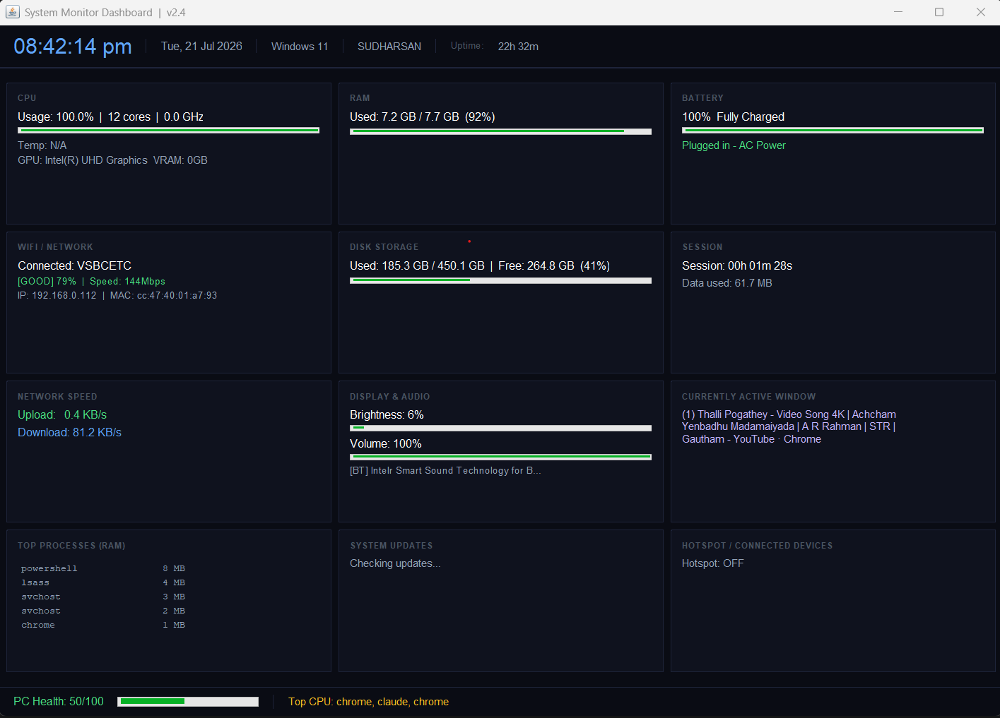
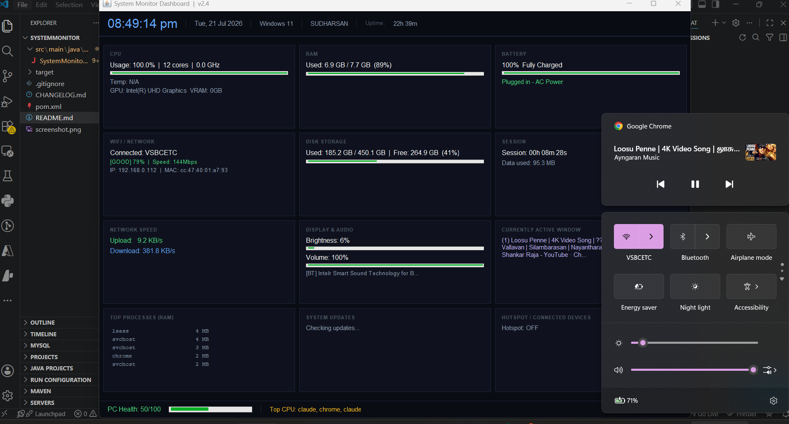

# System Monitor Dashboard

A real-time desktop application built in Java that monitors all PC health metrics in a single unified dark-themed window — updating every 200ms.....




---

## Features

| Category | What it monitors |
|---|---|
| **CPU** | Usage %, core count, frequency, temperature |
| **RAM** | Used / Total in GB with visual bar |
| **Battery** | %, charging state, AC/battery mode, time remaining |
| **WiFi** | SSID name, signal strength, speed, IP, MAC |
| **Disk** | Used / Free / Total storage |
| **Network** | Live upload / download speed in KB/s |
| **Display** | Screen brightness % (laptop) |
| **Audio** | System volume % + active audio device name |
| **Active Window** | Currently focused app / tab title (updates in 200ms) |
| **Top Processes** | Top 7 RAM-consuming processes |
| **Hotspot** | ON/OFF status + connected device IPs |
| **Weather** | Live temperature and wind speed from your city |
| **Updates** | Windows update status |
| **PC Health Score** | 0–100 score based on CPU + RAM + Disk load |
| **Session** | How long PC has been used + data consumed |

---

## Architecture

```
┌─────────────────────────────────────────────────────┐
│              Background Thread Pool (8 threads)      │
│  ┌──────────┐ ┌──────────┐ ┌──────────┐ ┌────────┐  │
│  │ Volume   │ │ Active   │ │ WiFi     │ │Weather │  │
│  │ 250ms    │ │ Window   │ │ SSID     │ │ 5min   │  │
│  │          │ │ 200ms    │ │ 2s       │ │        │  │
│  └────┬─────┘ └────┬─────┘ └────┬─────┘ └───┬────┘  │
│       │            │            │            │        │
│       └────────────┴────────────┴────────────┘        │
│                    │ AtomicReference / AtomicInteger   │
└────────────────────┼────────────────────────────────── ┘
                     │ reads cache (never blocks)
          ┌──────────▼──────────┐
          │  Swing Timer 200ms  │  ← UI thread only
          │  Updates all labels │
          └─────────────────────┘
```

**Key design:** Background threads fetch slow data (PowerShell, APIs), store in atomic cache. UI reads from cache every 200ms — never waits for PowerShell, never freezes.

---

## Tech Stack

| Technology | Purpose |
|---|---|
| **Java 17** | Core language |
| **Java Swing** | Desktop UI (only desktop apps can access hardware) |
| **OSHI 6.4.6** | CPU, RAM, battery, disk, GPU, network hardware data |
| **JNA 5.13** | Native Windows system call bindings (used by OSHI) |
| **PowerShell** | Volume, brightness, active window, battery mode |
| **Windows WMI** | `WmiMonitorBrightness`, `Win32_Battery`, `Win32_SoundDevice` |
| **Windows user32.dll** | `GetForegroundWindow` — active window detection |
| **winmm.dll** | `waveOutGetVolume` — system volume reading |
| **netsh wlan** | WiFi SSID and signal strength |
| **ip-api.com** | IP-based location detection |
| **Open-Meteo API** | Free weather API (no key required) |
| **Maven** | Build and dependency management |

---

## Setup & Run

### Prerequisites
- Java 17 or above → [Download JDK](https://adoptium.net)
- Apache Maven 3.9+ → [Download Maven](https://maven.apache.org/download.cgi)
- Windows 10 / 11

### Steps

```powershell
# 1. Clone the repository
git clone https://github.com/Sudharsan555/SystemMonitor.git

# 2. Enter project folder
cd SystemMonitor

# 3. Build
mvn clean package

# 4. Run
java -jar target/SystemMonitor-1.0.jar
```

---

## API Reference

| API | Endpoint | Used for |
|---|---|---|
| ip-api.com | `http://ip-api.com/json/` | City, lat/lon, country |
| ipinfo.io | `https://ipinfo.io/json` | Fallback location |
| Open-Meteo | `https://api.open-meteo.com/v1/forecast` | Temperature, wind, weather code |

No API keys required. All APIs are free and open.

---

## Troubleshooting

| Problem | Fix |
|---|---|
| `BUILD FAILURE` | Make sure you are inside the `SystemMonitor` folder that has `pom.xml` |
| Volume shows N/A | Run as Administrator once |
| Brightness shows External monitor | Normal for desktop PCs or external displays |
| Weather shows unavailable | Check internet connection |
| Active window not updating | Normal — refreshes every 200ms |
| Temperature shows N/A | Some laptops don't expose CPU temp sensors to WMI |

---

## Project Structure

```
SystemMonitor/
├── pom.xml
├── README.md
├── .gitignore
├── screenshot.png
└── src/
    └── main/
        └── java/
            └── com/sysmonitor/
                └── SystemMonitor.java   ← entire app in one file
```

---

## Author

**SUDHARSAN V**
B.E. Computer Science and Engineering (2023–2027)
V.S.B. College of Engineering Technical Campus

GitHub: [Sudharsan555](https://github.com/Sudharsan555)
LinkedIn: [sudharsan555](https://linkedin.com/in/sudharsan555)
